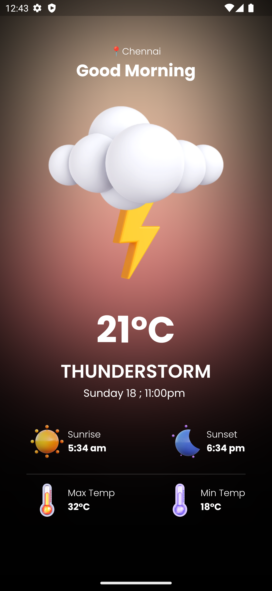

# asa_weather

This Weather App is a simple yet powerful mobile application built using the Flutter framework and the Bloc state management library. It allows users to check the weather conditions for their location and other locations around the world. The app leverages the OpenWeatherMap API to fetch weather data and provides a user-friendly interface to view weather forecasts.
## Getting Started


## Installation

### Clone the Repository

```bash
git clone https://github.com/yourusername/weather_app_flutter_bloc.git
cd weather_app_flutter_bloc
```

### Install Dependencies
Ensure that you have Flutter and Dart installed on your machine. If not, follow the official Flutter installation guide to get set up.

Once Flutter is installed, run:

```bash
flutter pub get
```

API Key Configuration
You'll need to obtain an API key from OpenWeatherMap to fetch weather data. Edit the file data.dart in the project lib/data folder and add your API key as follows:

Run the App
You can now run the app on your preferred emulator or physical device using the following command:

```bash
flutter run
```
